# AI Career Coach 🚀

A comprehensive AI-powered career development platform that helps professionals enhance their job search, interview preparation, and career growth through intelligent guidance and personalized tools.

## ✨ Features

### 🧠 AI-Powered Career Guidance

- **Personalized Career Advice**: Get tailored career recommendations based on your industry, experience, and goals
- **Industry Insights**: Access real-time market trends, salary data, and growth opportunities
- **Skill Gap Analysis**: Identify areas for improvement with AI-driven recommendations

### 📝 Smart Resume Creation

- **ATS-Optimized Resumes**: Generate resumes that pass Applicant Tracking Systems
- **AI-Powered Content**: Get intelligent suggestions for resume content and formatting
- **Real-time Feedback**: Receive instant feedback on resume quality and optimization tips
- **Markdown Editor**: Rich text editing with live preview

### 💼 Cover Letter Generator

- **AI-Generated Content**: Create compelling cover letters tailored to specific job descriptions
- **Company-Specific Customization**: Generate targeted content for each application
- **Template Library**: Access professional templates for different industries
- **Draft Management**: Save and edit multiple versions of your cover letters

### 🎯 Interview Preparation

- **Mock Interviews**: Practice with AI-powered interview simulations
- **Role-Specific Questions**: Get questions tailored to your target position and industry
- **Performance Analytics**: Track your progress with detailed scoring and feedback
- **Improvement Tips**: Receive personalized suggestions to enhance your interview skills
- **Quiz Categories**: Practice technical, behavioral, and industry-specific questions

### 📊 Progress Tracking

- **Performance Dashboard**: Monitor your career development journey
- **Assessment History**: Review past interview performances and improvements
- **Skill Development**: Track skill acquisition and growth over time
- **Industry Trends**: Stay updated with market insights and salary data

### 🔐 User Management

- **Secure Authentication**: Powered by Clerk for reliable user management
- **Profile Customization**: Set up your professional profile with industry and experience details
- **Onboarding Flow**: Guided setup process for new users
- **Data Privacy**: Secure handling of personal and professional information

## 🛠️ Technology Stack

### Frontend

- **Next.js 15** - React framework with App Router
- **React 19** - Modern React with latest features
- **TypeScript** - Type-safe development
- **Tailwind CSS** - Utility-first CSS framework
- **Radix UI** - Accessible component primitives
- **Lucide React** - Beautiful icons
- **React Hook Form** - Form handling and validation
- **Zod** - Schema validation

### Backend & Database

- **Prisma** - Type-safe database ORM
- **PostgreSQL** - Reliable relational database
- **Next.js API Routes** - Server-side API endpoints
- **Inngest** - Background job processing

### AI & External Services

- **Google Generative AI** - AI-powered content generation
- **Clerk** - Authentication and user management
- **NextAuth.js** - Session management

### UI/UX

- **Shadcn/ui** - Modern component library
- **Tailwind CSS** - Styling and animations
- **Sonner** - Toast notifications
- **React Markdown** - Markdown rendering
- **Recharts** - Data visualization
- **React Spinners** - Loading states

### Development Tools

- **ESLint** - Code linting
- **PostCSS** - CSS processing
- **Turbopack** - Fast development builds

## 🚀 Getting Started

### Prerequisites

- Node.js 18+
- PostgreSQL database
- Google AI API key
- Clerk account

### Installation

1. **Clone the repository**

   ```bash
   git clone https://github.com/yourusername/ai-career-coach.git
   cd ai-career-coach
   ```

2. **Install dependencies**

   ```bash
   npm install
   ```

3. **Set up environment variables**

   ```bash
   cp .env.example .env.local
   ```

   Add your configuration:

   ```env
   DATABASE_URL="postgresql://..."
   CLERK_SECRET_KEY="your_clerk_secret"
   CLERK_PUBLISHABLE_KEY="your_clerk_publishable_key"
   GOOGLE_AI_API_KEY="your_google_ai_key"
   INNGEST_EVENT_KEY="your_inngest_key"
   INNGEST_SIGNING_KEY="your_inngest_signing_key"
   ```

4. **Set up the database**

   ```bash
   npx prisma generate
   npx prisma db push
   ```

5. **Run the development server**

   ```bash
   npm run dev
   ```

6. **Open your browser**
   Navigate to [http://localhost:3000](http://localhost:3000)

## 📱 Screenshots

### Landing Page

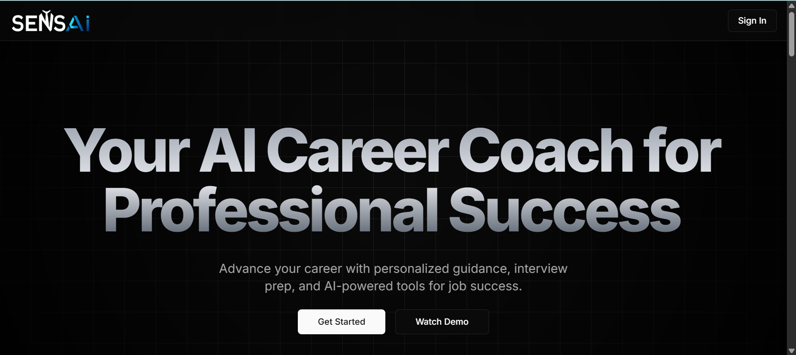

### Resume Builder

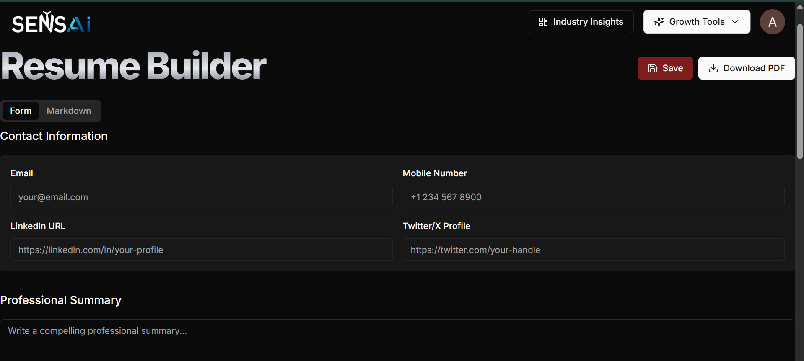
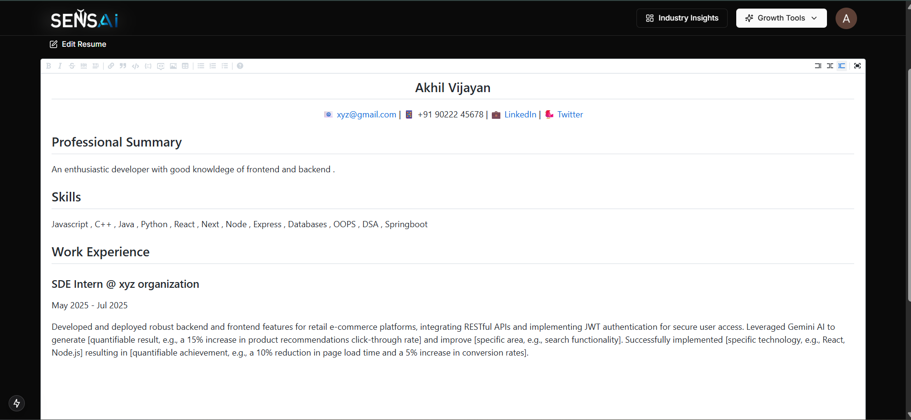
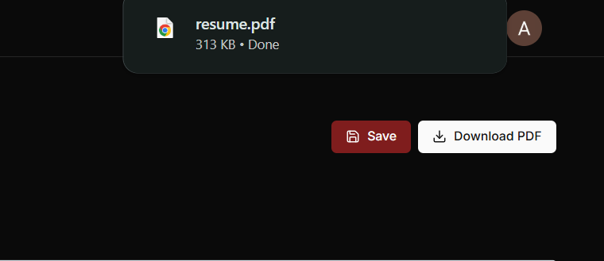

### Interview Preparation

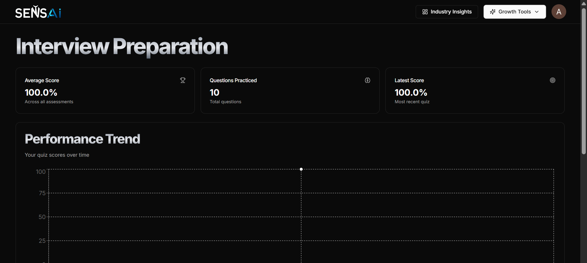
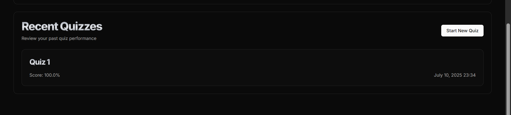
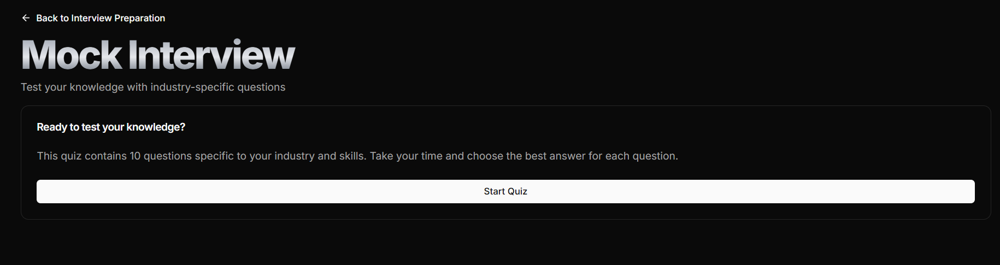
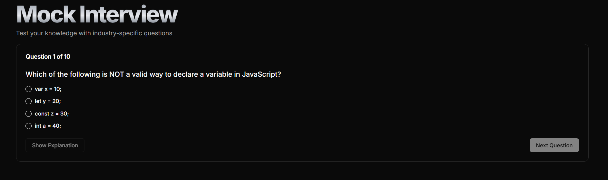

### Cover Letter Generator

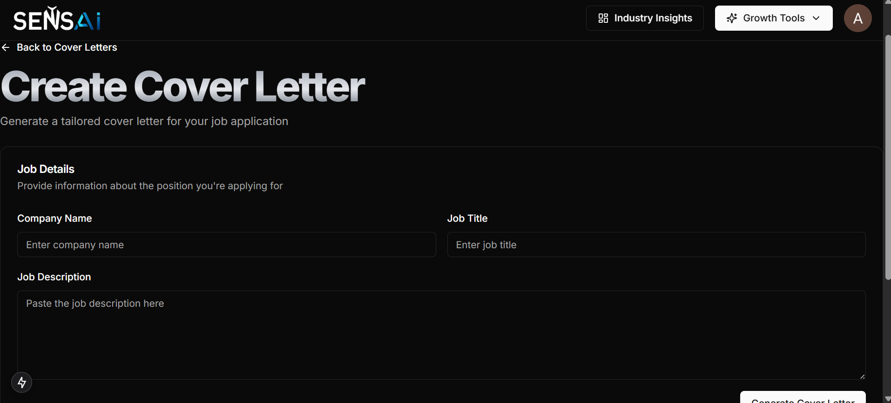
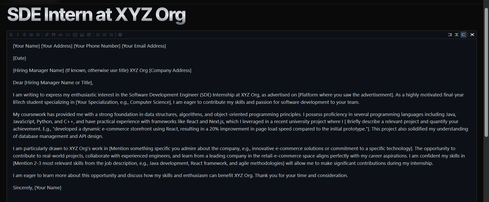

### Industry Insights & Career Guidance

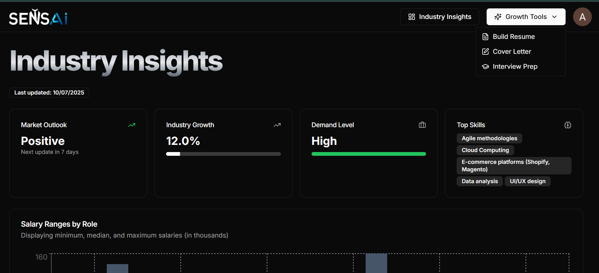
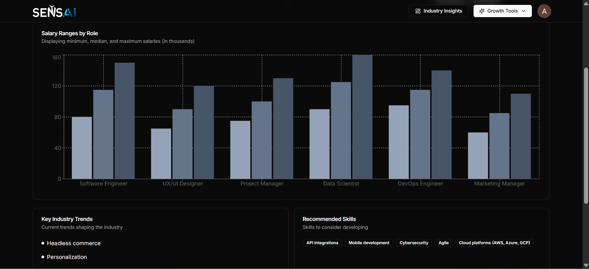

## 🎥 Video Walkthrough

<!-- Add your video walkthrough here -->

[](https://www.youtube.com/watch?v=YOUR_VIDEO_ID)

## 🏗️ Project Structure

```
ai-career-coach/
├── app/                    # Next.js App Router
│   ├── (auth)/            # Authentication routes
│   ├── (main)/            # Main application routes
│   │   ├── dashboard/     # Dashboard and analytics
│   │   ├── resume/        # Resume builder
│   │   ├── interview/     # Interview preparation
│   │   ├── ai-cover-letter/ # Cover letter generator
│   │   └── onboarding/    # User onboarding
│   └── api/               # API routes
├── components/             # Reusable UI components
├── lib/                    # Utility functions and configurations
├── prisma/                 # Database schema and migrations
├── data/                   # Static data and content
└── public/                 # Static assets
```

## 🔧 Key Features Implementation

### AI Integration

- **Google Generative AI**: Powers resume suggestions, cover letter generation, and career advice
- **Prompt Engineering**: Optimized prompts for different use cases
- **Content Validation**: Ensures generated content meets quality standards

### Database Design

- **User Management**: Comprehensive user profiles with industry and experience data
- **Assessment Tracking**: Detailed interview performance analytics
- **Document Management**: Resume and cover letter storage with version control
- **Industry Insights**: Real-time market data and trends

### Authentication & Security

- **Clerk Integration**: Secure user authentication and session management
- **Role-based Access**: Different features based on user status
- **Data Privacy**: Secure handling of personal information

## 📄 License

This project is licensed under the MIT License - see the [LICENSE](LICENSE) file for details.
